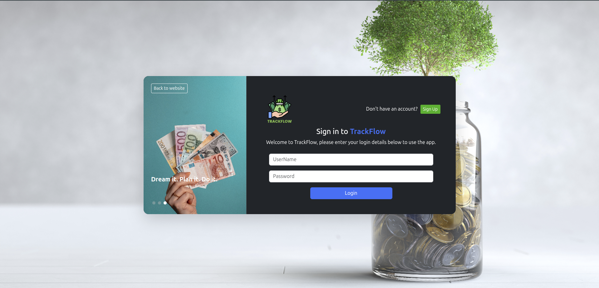
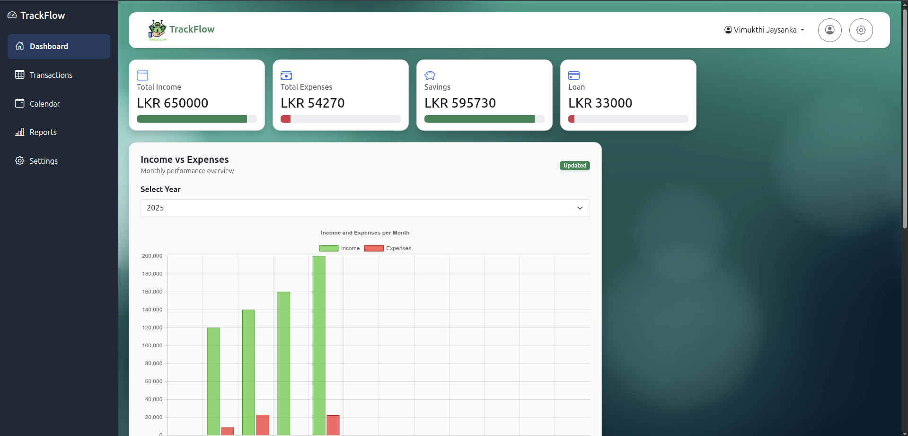
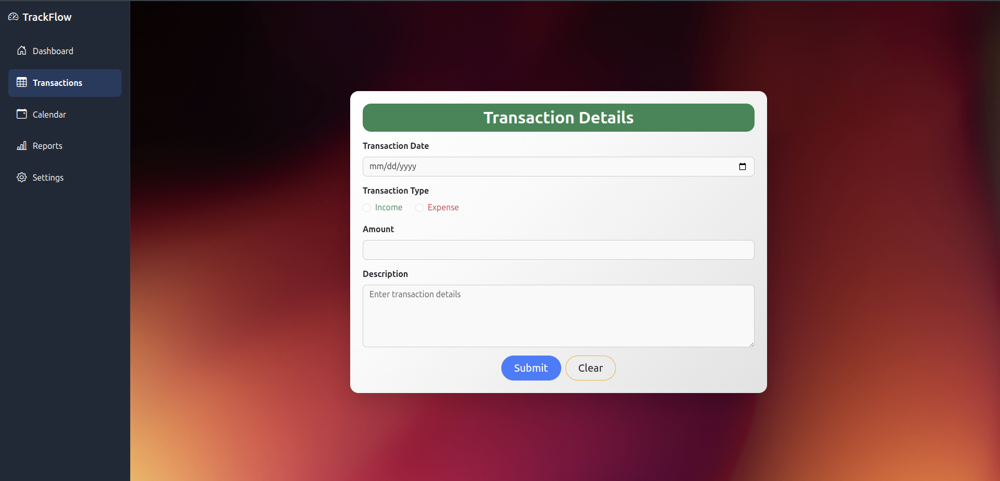
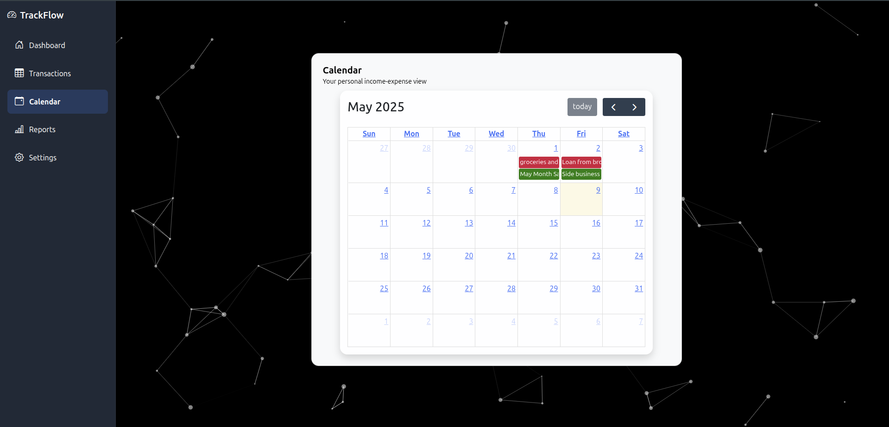
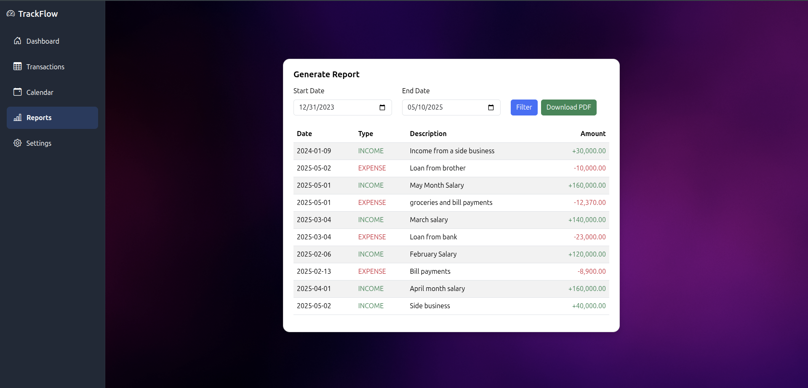
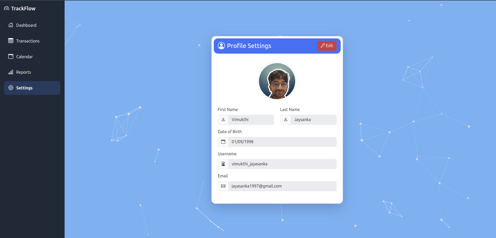

# Trackflow Frontend App

**Trackflow** is a modern financial management frontend application built using Angular. It provides users with an intuitive dashboard to manage income, expenses, profiles, statistics, and more. This project connects to a Spring Boot backend and supports dynamic UI updates and Google Cloud Storage integration for profile image uploads.

> *Generated using [Angular CLI](https://github.com/angular/angular-cli) version 19.2.1*

---

## 🚀 Features

* 📊 **Interactive Dashboard** with cards, statistics, recent transactions, and a calendar
* 🔐 **User Authentication** (Sign Up / Sign In)
* 👤 **Profile Management** with image uploads (via GCP Bucket)
* ➕ **Add & Track Transactions** (income/expense)
* ⚙️ **Modular Architecture** using Angular components and services
* 🌐 **API Integration** with a Spring Boot backend
* 💡 **Responsive UI** with reusable and shared components

---
## 📸 Screenshots

### 🔐 Login Page

### 🏠 Dashboard

### ➕ Add Transaction

### 📅 Calender

### 📄 Reports

### 👤 Profile Management


---

## 📦 Project Structure

```
src/
├── app/
│   ├── auth/
│   │   ├── components/                # Sign in / Sign up / Landing-page components
│   │   ├── auth.module.ts/            # Auth module declarations
│   │   ├── auth-routing.module.ts/    # Routing module for authentication components
│   ├── dashboard/                     # dashboard UI components (cards, navs, forms)
│   ├── interface/                     # Interfaces like Transaction
│   ├── service/                       # Service for App like notification, confirmation
│   ├── shared/                        # shared UI components like modals
│   └── app.module.ts                  # App module declarations
├── environments                       # Properties files
```

---

## 🧪 Development Setup

To get started with local development:

```bash
npm install
ng serve
```

Then visit `http://localhost:4200/` in your browser. The app reloads automatically upon code changes.

---

## 🔧 Code Scaffolding

You can easily generate components, directives, services, and more:

```bash
ng generate component my-component
```

To see more scaffolding options:

```bash
ng generate --help
```

---

## 🏗️ Build

To build the application for production:

```bash
ng build
```

Build artifacts will be stored in the `dist/` directory. Use the `--configuration production` flag for optimized builds.

---

## ⚙️ Backend & API
Trackflow communicates with a Spring Boot backend that exposes secure REST APIs for:

* 🔐 Authentication
* 💸 Transaction management
* 🖼️ Profile image uploads (stored in GCS)

### ⚠️ CORS Note: The backend only accepts requests from the Angular development server: http://localhost:4200

---

## ☁️ GCP Integration

This app integrates with **Google Cloud Platform** (GCP) to handle user profile image uploads:

* Bucket: `trackflow-bucket`
* Upload flow is handled client-side via a service account and secure API calls.

---

## 📚 Learn More

* [Angular CLI Documentation](https://angular.dev/tools/cli)
* [Angular Dev Docs](https://angular.dev/)
* [Spring Boot Backend (Trackflow API)](https://spring.io/projects/spring-boot)
* [Google Cloud Storage](https://cloud.google.com/storage)

---
## 🏷️ Version

>v1.0.0

---

## 🧑‍💻 Author

Developed by **Vimukthi Jayasanka**
Full-stack Software Engineer | IJSE 

---

## 📄 License

This project is licensed under the MIT License. See the [LICENSE](license.txt) file for details.


